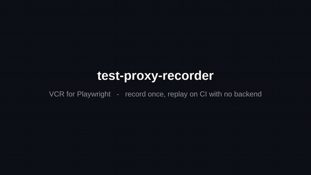

# test-proxy-recorder

> **VCR for Playwright** — record real API responses once, replay them deterministically on CI. Covers Next.js & TanStack Start SSR, browser, and WebSocket traffic. No backend, no hand-written mocks.

[](https://github.com/asmyshlyaev177/test-proxy-recorder/stargazers)
[](https://www.npmjs.com/package/test-proxy-recorder)
[](https://github.com/asmyshlyaev177/test-proxy-recorder/actions/workflows/test.yml)
[](https://www.npmjs.com/package/test-proxy-recorder)
[](https://github.com/asmyshlyaev177/test-proxy-recorder/blob/master/LICENSE)
[](https://discord.gg/w7rgYbY5zz)
[](https://asmyshlyaev177.dev)

<p align="center">
  
</p>

```text
                Record mode                          Replay mode

  App ──> Proxy ──> Real API            App ──> Proxy ──> Disk
            │                                         │
            └──> saves to disk                        └──> serves saved responses
                 (.mock.json)                              (.mock.json)
```

## Why

Every flaky e2e run has the same root cause: the network. This records real traffic once, then replays it byte-for-byte on CI — so tests pass with the backend off.

- **No backend on CI** — replay from disk, no network.
- **No manual mocks** — capture real interactions, never hand-write fixtures.
- **SSR + browser + WebSocket** — record wherever requests originate.

## Comparison

test-proxy-recorder is the one that records **real** traffic across SSR, browser, and WebSockets without hand-written mocks — that combination is the gap the others leave open.

| Feature | **test-proxy-recorder** | `routeFromHAR` | MSW | Polly.js | playwright-network-cache | Mocky Balboa |
| --- | :---: | :---: | :---: | :---: | :---: | :---: |
| Record real traffic | ✅ | ✅ | ❌ | ✅ | ✅ | ❌ |
| Server-side (SSR) | ✅ | ❌ | ✅ | ⚠️ | ❌ | ✅ |
| Browser-side | ✅ | ✅ | ✅ | ✅ | ✅ | ✅ |
| WebSocket | ✅ | ❌ | ✅ | ❌ | ❌ | ❌ |
| Playwright-native | ✅ | ✅ | ❌ | ❌ | ✅ | ✅ |
| Maintained | ✅ | ✅ | ✅ | ❌ | ✅ | ✅ |

> ⚠️ Polly.js intercepts Node HTTP, so SSR mocking is possible inside the app process, but not as part of a Playwright run. MSW and Mocky Balboa replay real responses too — but you hand-write the mocks rather than recording them.

See the [full comparison in the docs](https://test-proxy-recorder.dev/docs/#comparison) — including when to reach for something else.

## Quick start

**Fastest path — hand it to your AI coding agent.** Copy this, swap in your backend URL, and paste it into Claude Code / Cursor / etc. (it runs `init` and finishes the wiring):

```text
# Set up test-proxy-recorder for end-to-end tests in this project, then follow the instructions that `init` prints. Run these commands:
  npm install --save-dev test-proxy-recorder
  npx @tanstack/intent@latest install
  npx test-proxy-recorder init http://localhost:3002 --port 8100 --dir ./e2e/recordings
# Then complete the steps init prints: point the app's API base URL at the proxy in dev/test only, tag server-side fetches (Next.js), add a smoke test, and verify record → replay.
```

Prefer to wire it by hand:

```bash
npm install --save-dev test-proxy-recorder
npx test-proxy-recorder init http://localhost:3002 --port 8100 --dir ./e2e/recordings
```

`init` scaffolds everything non-destructively: proxy config, a Playwright fixture, a global teardown, `package.json` scripts, and (on Next.js) wires SSR fetch tagging into your root layout via `registerProxyFetch()`. It finishes by printing a tailored AI-agent prompt for the app-specific steps it can't guess.

The one thing `init` can't guess is which env var holds your API base URL. Point it at the proxy when the recorder is enabled, at the real backend otherwise — the proxy never runs in production:

```ts
const API_BASE =
  process.env.NODE_ENV === 'production' && !process.env.TEST_PROXY_RECORDER_ENABLED
    ? 'https://api.example.com'
    : 'http://localhost:8100'; // proxy address from `init`
```

Then set `MODE = 'record'`, run once against the real API, flip to `'replay'`, and commit `e2e/recordings/`. CI now runs with the backend off.

Full walkthrough: [quick start](https://test-proxy-recorder.dev/docs/getting-started/quick-start/) · [manual setup](https://test-proxy-recorder.dev/docs/getting-started/manual-setup/).

> **Did that just save you an afternoon of hand-writing mocks?**
> A [⭐ on GitHub](https://github.com/asmyshlyaev177/test-proxy-recorder) takes one second and is how the next person fighting flaky e2e tests finds this. I'm a solo maintainer and read every star as a signal to keep going.

## Examples

Full working apps in [`apps/`](https://github.com/asmyshlyaev177/test-proxy-recorder/tree/master/apps), each with its own README:

- [Next.js 16](https://github.com/asmyshlyaev177/test-proxy-recorder/tree/master/apps/example-nextjs16) — SSR + browser + WebSocket chat
- [Next.js Edge runtime](https://github.com/asmyshlyaev177/test-proxy-recorder/tree/master/apps/example-nextjs-edge) — `registerProxyFetch` for concurrent replay
- [TanStack Start](https://github.com/asmyshlyaev177/test-proxy-recorder/tree/master/apps/example-tanstack-start) — SSR + browser, TanStack Query, ISR, WebSocket, and a real Cognito login
- [Chrome extension](https://github.com/asmyshlyaev177/test-proxy-recorder/tree/master/apps/example-extension) — browser-only, replayed offline
- [Crypto ticker](https://github.com/asmyshlyaev177/test-proxy-recorder/tree/master/apps/example-websocket) — third-party WebSocket feed
- [Authenticated app](https://github.com/asmyshlyaev177/test-proxy-recorder/tree/master/apps/example-auth-cognito) — real Cognito login, protected API replayed

## Docs

Everything else lives at [test-proxy-recorder.dev/docs](https://test-proxy-recorder.dev/docs/): [how it works](https://test-proxy-recorder.dev/docs/getting-started/how-it-works/), [CLI](https://test-proxy-recorder.dev/docs/guides/cli/), [config](https://test-proxy-recorder.dev/docs/guides/config/), [secret redaction](https://test-proxy-recorder.dev/docs/guides/secret-redaction/), [Next.js integration](https://test-proxy-recorder.dev/docs/integrations/nextjs/), [TanStack Start integration](https://test-proxy-recorder.dev/docs/integrations/tanstack-start/), [API reference](https://test-proxy-recorder.dev/docs/reference/api/readme/), [FAQ](https://test-proxy-recorder.dev/docs/reference/faq/).

Using an AI coding agent? `npx @tanstack/intent@latest install` adds skills so it generates correct setup code. See the [AI agent skills guide](https://test-proxy-recorder.dev/docs/reference/ai-agent-skills/).

## Requirements

- Node.js >= 20.0.0
- `@playwright/test` >= 1.0.0 (peer dependency)

## Feedback & contributing

This is built and maintained in the open by one person, and every bit of feedback steers what gets built next:

- **[⭐ Star the repo](https://github.com/asmyshlyaev177/test-proxy-recorder)** — the fastest way to support it, and it genuinely helps others discover it.
- **Hit a rough edge or have an idea?** [Open an issue](https://github.com/asmyshlyaev177/test-proxy-recorder/issues/new) or say hi in [Discord](https://discord.gg/w7rgYbY5zz) — even a one-line "this confused me" is gold.
- **Want to contribute?** PRs welcome. 

## AI skill

Using an AI coding agent (Claude Code, Cursor, Copilot, …)? The library ships [`@tanstack/intent`](https://www.npmjs.com/package/@tanstack/intent) skills so the agent generates correct setup code. Install the package, then write the agent guidance:

```bash
npm install --save-dev test-proxy-recorder
npx @tanstack/intent@latest install
```

`install` adds skill-discovery guidance to your agent config (`CLAUDE.md`, `.cursorrules`, …); the agent loads the `proxy-setup`, `nextjs-ssr`, and `tanstack-start` skills on demand. List or load them directly with `npx @tanstack/intent@latest list` and `npx @tanstack/intent@latest load test-proxy-recorder#proxy-setup`. Full guide: [AI agent skills](https://test-proxy-recorder.dev/docs/reference/ai-agent-skills/).

The skill sources live in [`packages/test-proxy-recorder/skills/`](packages/test-proxy-recorder/skills/).

## Hire me

I'm **Aleksandr Smyshliaev** — author and maintainer of this tool. Senior
frontend engineer (React / Next.js / TypeScript, 8+ years), and **available for
full-time remote work right now**.

This project exists because I spent years fixing other people's flaky test
suites. That's the kind of work I'm best at: the boring infrastructure that
decides whether a codebase is still pleasant six months in.

- **Best at** — component libraries, state management, and test suites that
  survive a refactor.
- **Also mine** —
  [react-horizontal-scrolling-menu](https://github.com/asmyshlyaev177/react-horizontal-scrolling-menu)
  (~84k weekly installs),
  [state-in-url](https://github.com/asmyshlyaev177/state-in-url) (typed URL
  state), [llm-queue](https://github.com/asmyshlyaev177/llm-queue).
- **Where** — Tbilisi, Georgia (GMT+4), full CET overlap. Registered contractor
  entity, so B2B engagement needs no employer-of-record setup.
- **Reach me** — [asmyshlyaev177.dev](https://asmyshlyaev177.dev) ·
  [asmyshlyaev177@gmail.com](mailto:asmyshlyaev177@gmail.com) ·
  [LinkedIn](https://linkedin.com/in/asmyshlyaev177) · Telegram @asmyshlyaev177

## License

MIT
